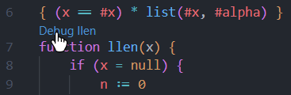
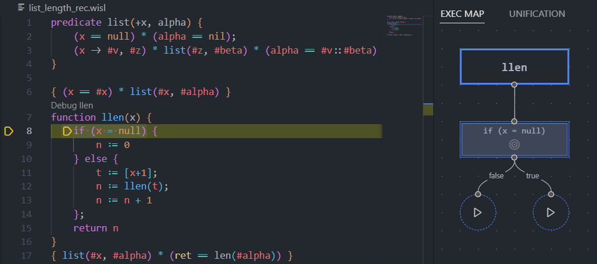
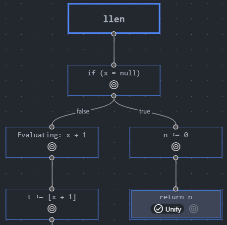
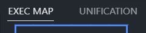
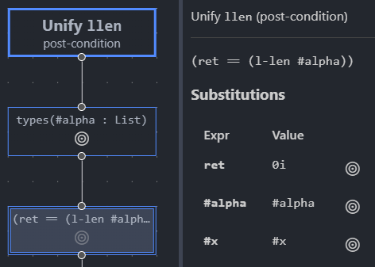

The Gillian Debugger
====================

The Gillian debugger provides a custom interface for visualising symbolic execution and unification, via a bespoke VSCode extension.

.. danger::
  The debugger is still in development; expect bugs, missing features, and breaking changes!

  Feel free to `report any issues or feature requests <https://github.com/GillianPlatform/Gillian/issues?q=label%3Adebugger%2Cdebug-ext+>`_.

Setup
-----

The debugger is used via a custom VSCode extension, found under the ``debugger-vscode-extension/`` directory in the repo.

To try out the debugger, follow these steps:

* Install `the base Gillian extension <https://marketplace.visualstudio.com/items?itemName=gillian.code-gillian>`_
* Make sure Gillian is built (see :doc:`install`)
* cd into ``debugger-vscode-extension/``
* Run ``yarn`` to set up dependencies
* Run ``yarn build`` to build the extension (or ``yarn watch`` to rebuild automatically)
* In the *Run and debug* tab of VSCode, make sure *Debugger Extension* is selected from the dropdown, and click the green play button to start the extension

  .. image:: _static/img/debug/start_extension_button.png
    :width: 175px
    :align: center

* A new VSCode window should open in ``debugger-vscode-extension/sampleWorkspace/``, with the extension installed
* In this window, open the workspace settings, and under the *Extensions > Gillian Debugger* section:

  * Make sure *Run mode* is set to ``source``
  * Set *Source directory* to ``${workspaceFolder}/../../``
  * If you want to disable automatic folding and unfolding of predicates, check *Use manual proof*

A Guided Tour
-------------

Let's take it for a spin! Open ``list_length_rec.wisl``, and click *Debug llen* to start the debugger.

.. note:: Make sure you aren't running any ``esy`` processes (e.g. ``esy watch``), as this may prevent the debugger from starting.

You should then be presented with a new panel showing the path of execution in a graph. Here you can see the current command in the highlighted node, and two subsequent commands yet to be executed.

In the left-hand panel, you can see the current state of symbolic execution.

.. image:: _static/img/debug/state.png
  :width: 250px
  :align: center

Each section of the state represents:

* **Store**: The values of program variables
* **Memory**: Memory assertions, e.g. the contents of the heap
* **Pure Formulae**: Pure (i.e. first-order logic) formulae
* **Typing Environment**: Variable types
* **Predicates**: Any known predicates

.. tip:: Take care to remember that the *Memory* section may not tell the full story of the heap; some information may be 'hidden' in the definitions of *Predicates*.

Click on the play button under the *true* branch to execute the next command (in the true case of the if-else). Notice how our *Pure Formulae* have updated to show that we now know ``#x`` is ``null``.

.. image:: _static/img/debug/step.png
  :width: 500px
  :align: center

Now, click the target button |target-button| on the first command to 'jump' back to it. Gillian stores the full trace of execution, so you can jump back and forth, and across branches, as you please.

With the first command selected, click the *Continue* button in the standard debugger controls to fully execute the rest of the program. You should see execution complete with no errors, and all unifications succeeding - lucky us!

You'll know a unification has occurred when a *Unify* badge appears on the command node. In this case, the function is returning, so Gillian has unified with the post-condition. Let's take a closer look; when a command with a unification is selected, click the *UNIFICATION* tab at the top to look into the unification process.

In unification, Gillian attempts to match the state against a sequence of assertions (called a unification plan). Click the target button |target-button| on one of the assertions to see what's been learned so far.

If unification has failed, the offending assertion will be highligted in red.

.. caution:: As of the time of writing, the debugger has only been tested with *wisl* - you're free to try other target languages, but do so at your own peril!

Technical Details
-----------------

The Gillian debugger started life as a strict follower of the Debug Adapter Protocol. However, the DAP was designed with concrete execution in mind, thus proving too restrictive for the non-linearity of symbolic execution. However, the exensibility of the DAP, together with the power of VSCode extensions, allowed us to transcend these restrictions with a custom interface (while, unfortunately, sacrificing near free-of-charge cross-IDE support).

The Gillian debugger's "stack" consists of:

* The **Webview** is the custom interface, built as a React single-page-app. It is built separately from, and 'embedded' into, the VSCode extension, using VSCode's provided message passing API to communicate with the extension (and by extension, Gillian).
* The **Extension** acts as a middleman of sorts; it tells VSCode how to run Gillian in debug mode, initialises a debugger session, and passes messages between Gillian and the webview.
* **Gillian** is the core of the debugger; it performs the actual symbolic execution and unification. It uses custom events and commands alongside the provided DAP ones to bidirectionally communicate with the extension.

Credit goes to the authors of `React Flow <https://reactflow.dev/>`_, the library responsible for core parts of the debugger interface.
